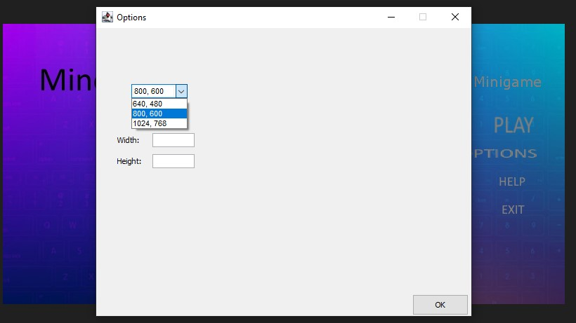
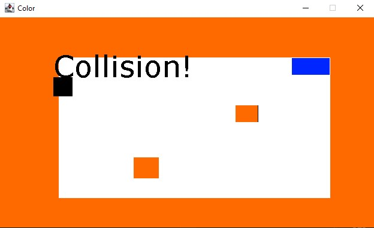
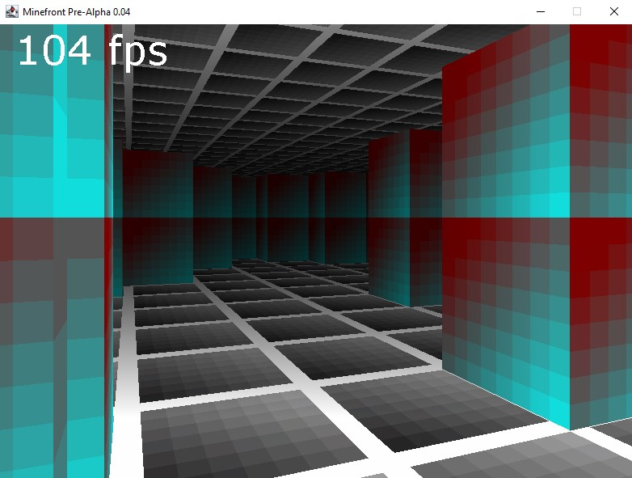
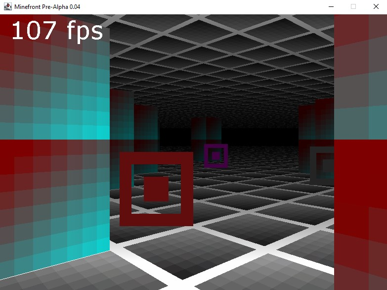

3D Game Programming\
Using Java Built-in Libraries from scratch not graphics Card e.g. DirectX,OpenGL\
instructor: thecherno

3D X,Y,Z axis Ray cast Render Engine
Features:\
Mouse Wraping\
Custom Launcher + GUI (Multi-Threading)\
Custom Resolutions\
X,Y,Z axis navigation\
Double side rendering aka Flipped Normals\
Pixel simple Texturing + Transparency\
Sprite sheets\
Simple Collision detection

